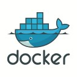

# mysql-dev

Mysql server and phpMyadmin for development purpose

## Sections
- [Docker](#Docker)
- [phpMyAdmin](#phpMyAdmin)
- [init scripts](#init-scripts)
- [docker toolbox](#docker-toolbox)

---

## Docker

| Action                 | Execute                          |
|------------------------|----------------------------------|
| Start                  | docker-compose up -d             |
| Down                   | docker-compose down              |

## phpMyAdmin
Log in phpMyAdmin at localhost:8080

## init scripts
/init/ Folder for dumping databases and tables in alphabetical order

## docker toolbox
[Docker toolbox web page](https://docs.docker.com/toolbox/toolbox_install_windows/)

Edit shared folder for **default machine** in _virtual toolbox_:

> c/docker/mysql    c:\Users\Mysuser\Documents\mysql  automount and permanent

